# Architecture

This slice turns a team's entitlement, written as a five-line file in Git, into enforced
limits on a Kubernetes cluster. This page covers the shape of the slice, the production
platform it stands for, what it leaves out, what it trusts, and the one trade-off it makes
worse on purpose.

Source: [`diagrams/architecture.mmd`](diagrams/architecture.mmd). Render it with
`docker run --rm -v "$PWD:/data" minlag/mermaid-cli:11.4.2 -i architecture.mmd -o architecture.svg`.

## How a team's entitlement becomes enforcement

There are two paths through the diagram: onboarding a team, and admitting one of its pods.

**Onboarding** starts with a pull request to `slice/tenants/<team>.yaml`. CODEOWNERS routes
it to the platform team. `create.sh` renders each spec through one Helm chart and applies the
result with `kubectl apply`. Helm renders templates only and keeps no release state.
`values.schema.json` rejects an unknown tier, a negative cap, or an extra key before anything
reaches the cluster. The chart writes:

| Spec field | Kubernetes object |
|---|---|
| `name` | Namespace, ServiceAccount `<name>-sa` |
| `gpuCap` | ResourceQuota `gpu-cap` on `requests.nvidia.com/gpu` |
| `tier` | Namespace label `platform.example.com/priority-class`, mapped `low → tenant-low`, `high → tenant-high` in `chart/templates/_helpers.tpl` |
| `computePool` | Namespace label `platform.example.com/compute-pool` |
| `networkIsolation` | NetworkPolicy that admits ingress from the same namespace only |
| (fixed for every team) | Role and RoleBinding for workloads, Pod Security `baseline` |

The third team, `inference-eval`, needed its spec file and nothing else. Case `overflow` in
`verify.sh` onboards a fourth, temporary team through the same `onboard` function.

**Admission** runs every pod a tenant creates through four checks, in the order the API server
runs them:

1. **RBAC.** The tenant's Role covers pods, deployments, jobs, services, config maps and secrets
   in its own namespace. It gives read-only access to its quota and events, and nothing on
   namespaces, quotas, policies, RBAC, or any cluster-scoped object.
2. **Pod Security `baseline`.** It refuses privileged pods, `hostPath`, and host namespaces.
   Without it, "create pod" means root on the node, and every other boundary here is moot.
3. **ValidatingAdmissionPolicy `tenant-entitlement`.** The pod's `priorityClassName` must equal
   the namespace's entitled class. A pinned team's pod must also carry a matching
   `nodeSelector`. The policy reads namespace labels, which tenants cannot edit.
4. **ResourceQuota.** It checks the pod's GPU request against the team's cap.

After admission, the scheduler places the pod. Tier `high` preempts tier `low` when GPUs run
out. A team with `computePool: any` prefers the datacenter node and spills to cloud when it is
full. A team pinned to `datacenter` waits instead.

## The production platform this represents

The slice keeps the parts that carry the design decisions and fakes the parts that only need
money or hardware. [`production-design.md`](production-design.md) describes the full platform.

| In the slice | In production |
|---|---|
| One k3d cluster, two agent nodes labelled as pools | EKS clusters with GPU NodePools in AWS, and bare-metal GPU clusters in the datacenters |
| `nvidia.com/gpu: 4` written onto each node's status by `create.sh` | NVIDIA device plugin, run by the GPU Operator, advertising real devices |
| One chart applied by `kubectl apply` from a laptop | The same chart, versioned and applied by a pipeline per cluster, rolled out in stages |
| Namespace labels plus a validating policy | The same policy, plus injection of the class and pool so teams stop writing them |
| k3s's built-in NetworkPolicy enforcement | Cilium, with egress policy and identity-aware rules |
| CODEOWNERS on `slice/tenants/` | CODEOWNERS plus branch protection that requires code-owner review |
| `kubectl --as=system:serviceaccount:...` impersonation | OIDC groups for people and IRSA for workloads, bound to the same Roles |

## What the toy hides

Each item below is real work in production. The slice leaves it out because it needs real
GPUs, real cloud accounts, or more than one cluster.

| Hidden | Why it matters in production |
|---|---|
| NVIDIA device plugin and GPU Operator | They advertise real devices, install drivers, and re-advertise on every kubelet start. The slice's one-time patch survives a restart but not a node replacement. |
| MIG and time-slicing | These are how production shares one physical GPU between pods. Both need a real GPU and driver. |
| EKS NodePools, and spot versus on-demand versus capacity reservations | Cost and interruption trade-offs per pool. Spot interruptions are a second source of "node disappears". |
| Node autoscaling | Karpenter is EC2-only. The bare-metal equivalent is Cluster API with Metal3, deferred. The toy has fixed nodes, so nothing autoscales. |
| Bare-metal pools and Cluster API | Provisioning, firmware, and hardware replacement lead times measured in days, not seconds. |
| Cross-cluster GPU overflow | A Pending pod in cluster A never moves to cluster B, because the scheduler is per-cluster. Overflow between clusters needs MultiKueue, Karmada, or Liqo. The slice collapses two fleets into two node pools in one cluster. |
| Cilium ClusterMesh | It gives cross-cluster service discovery and load balancing. That is connectivity, not placement, and it does not solve the previous row. |
| Egress policy | The slice isolates ingress only. A tenant pod can still reach the internet and other tenants' egress targets. |
| Drift detection | Nothing notices if someone edits a quota by hand. Production needs a reconciler or a scheduled `kubectl diff`. |
| Identity: OIDC and IRSA | The slice proves boundaries by impersonating a ServiceAccount. |
| Queueing and fair share | Kueue or Slurm would queue whole jobs, share GPUs fairly within a tier, and admit gangs of pods together. The slice has only priority and preemption. |

## Why the boundaries are where they are

**The namespace is the tenant unit.** RBAC, ResourceQuota, NetworkPolicy, and Pod Security all
scope to a namespace natively, so one team maps to one namespace and no new mechanism is
needed. A namespace is not a sandbox, though. See [trust assumptions](#trust-assumptions).

**Entitlement lives in Git, not in the cluster.** A cap or tier change is a pull request with a
named reviewer and a history. The cluster holds only the rendered result. At three teams, a Helm
chart and `kubectl apply` are enough. A custom controller becomes worth building at around
fifty teams, when drift and fan-out need a reconciler, and it would read the same spec files.

**The spec states intent, not Kubernetes objects.** `tier: low` means "can be preempted", not a
PriorityClass name. The map from tier to class lives in platform-owned template code. The
platform can therefore change the backend, for example to Kueue priorities or Slurm QoS,
without touching any team's file or changing who approves it.

**Cap and tier are independent.** The cap bounds how much a team may hold. The tier decides who
wins when GPUs run out. `inference-eval` has the same cap as `research` and the opposite tier.
Case `preemption` shows that under contention the tier decides, not the cap.

**Every entitlement a pod could claim has an admission check.** Quota enforces the cap. The
validating policy enforces the tier and the pool. RBAC stops a team from editing either. This
closes a gap the first design had: denying `create priorityclass` stops a team from minting a
tier, but a pod could still name `tenant-high`. Case `escalation` asserts the denial.

**The policy validates instead of mutating.** A mutating policy could inject the class and pool,
so teams would not write them. The slice only validates, which costs teams one line per pod and
removes a component that could silently rewrite their workloads. Production would inject. See
[`CONTRACT.md`](CONTRACT.md#what-this-costs-teams).

## When a GPU node disappears

The brief asks about detection, replacement, queued work, and lost progress. The numbers below
were measured on k3s with the controller timers shortened for the demo.

**Detection.** The kubelet stops renewing its lease. After `--node-monitor-grace-period`, the
node lifecycle controller sets the node's `Ready` condition to `Unknown` and adds the taint
`node.kubernetes.io/unreachable:NoExecute`. With the grace period set to 20s, both appeared at
about t+19s.

The node's `.status.capacity` does not change. It still reads `nvidia.com/gpu: 4`. The
scheduler stops placing pods there because of the taint and the `NotReady` condition, not
because capacity drops to zero.

**Running pods.** Every pod gets a default toleration for that taint, 300 seconds unless
overridden. When it expires, the pod is evicted. With the toleration set to 20s, the pod was
gone at about t+38s. A Deployment or Job creates a replacement pod, which re-enters scheduling
with its tier. A bare pod is not replaced.

**Queued work.** Replacement pods compete like any other pod. With one of two GPU nodes gone,
the fleet has 4 GPUs against caps that sum to 14. High-tier replacements preempt low-tier pods
on the surviving node. Low-tier replacements wait, `Pending`, with a `FailedScheduling` event
that says `Insufficient nvidia.com/gpu`. Quota stops counting an evicted pod once its deletion
grace period has passed, even while the pod shows `Terminating` on the lost node, so the
replacements are not refused at admission. That last point follows from how the quota evaluator
treats terminating pods. It was not measured in this slice.

**Replacement.** The fake GPU capacity lives on the Node object, not in the kubelet. It survives
a restart of the same node. It is lost when the Node object is recreated, which is what a
replacement node is. That is why `create.sh` advertises the GPUs on every run, and why
production uses a device plugin: a DaemonSet re-advertises on every kubelet start, which covers
both restart and replacement.

**Lost progress.** Everything a GPU job did since its last checkpoint is lost. The platform
detects the loss and reschedules the pod. It does not checkpoint. Checkpointing is the team's
job, and the contract says so.

## Trust assumptions

The platform enforces boundaries between tenants. It does not protect tenants from the
platform's operators, and it does not treat a namespace as a sandbox.

### The Git repository is the trust root

Entitlements exist as files under `slice/tenants/`. The cluster holds only their rendered
result. Three consequences follow.

- Anyone who can merge to `main` can change any team's entitlement. CODEOWNERS decides who must
  review. It does not stop a push unless branch protection requires code-owner review. So the
  GitHub permission model is part of the security boundary. GitHub's `Write` role grants direct
  pushes to unprotected branches and PR merges, so it is not a harmless favour to hand out.
- A pipeline that applies tenant specs can grant any quota. Its credentials are as powerful as
  the platform team and need the same scoping and audit.
- `cluster-admin` bypasses every control here. The escalation path for operators is a reviewed
  pull request, which is social and auditable rather than technical.

### Tenants get a namespace, not a sandbox

- A namespace is an RBAC and NetworkPolicy boundary, not a kernel boundary. There is no gVisor,
  no Kata, and no seccomp or AppArmor profile beyond the runtime defaults.
- Pod Security `baseline` blocks the direct routes to the node: privileged containers,
  `hostPath`, and host namespaces. A kernel exploit from an ordinary container still defeats
  every isolation claim here. A workload that cannot accept that needs its own node pool or its
  own cluster. That is the honest answer to "when is a namespace enough?"
- Tenants cannot raise their own cap, borrow a higher tier, or mint a new one. The API server
  enforces this, and case `escalation` asserts each denial as the tenant's ServiceAccount.

### The verification first proves which cluster it is talking to

While this work was being tested on a second machine, that host's `/usr/local/bin/kubectl`
turned out to be a symlink to `k3s`. That binary defaults to `/etc/rancher/k3s/k3s.yaml`, a
different, live cluster running real workloads. The only thing that stopped the suite from
running against it was the file's `0600 root:root` permissions.

Had the file been readable, the suite would have created namespaces, patched a real node to
advertise fake GPUs, applied deny-ingress policies, and deleted pods in the wrong cluster. Then
it would have reported every check as passing, because each assertion would have been true
there.

Two things in the code follow from that:

1. `lib.sh` pins `KUBECONFIG` to a file for this cluster only and ignores any `KUBECONFIG`
   already in the environment. `k3d cluster create` runs with
   `--kubeconfig-update-default=false`, so the slice never touches the machine's default
   kubeconfig.
2. `assert_context` runs before the first cluster read or write. It refuses to continue unless
   the context is `k3d-gpu-slice` and the API server has a node named
   `k3d-gpu-slice-server-0`. The second check catches a kubeconfig whose context has the right
   name but points at another cluster. That case was tested with a second k3d cluster renamed
   to match.

### Every isolation check has a positive control

A probe that fails because DNS or endpoints are not ready looks the same as a probe blocked by
policy, and it fails in the direction that looks like success. So case `network` requires the
same-namespace probe to get HTTP 200 before and after the cross-tenant probe. If the control
never answers, the case fails instead of passing.

The same rule applies in case `escalation`. The tenant must be able to create an ordinary pod
before a denied pod counts as evidence. Otherwise RBAC refusing everything would pass.

### Assumed and not verified

- The fake GPU is opaque. Kubernetes cannot tell that `nvidia.com/gpu` means a GPU, and nothing
  checks that a pod holding one could use a device. In the slice the resource is an accounting
  token. In production the device plugin and driver back the claim.
- The advertised GPU count comes from a privileged patch, so the platform trusts it by
  definition. A tenant cannot forge it. Nothing measures it against hardware either.
- One cluster only. Nothing tests cross-cluster identity, certificate rotation, or mesh trust.
- Validation happens in two places: the chart's JSON schema at render time, and built-in
  admission in the cluster. There is no admission webhook. A spec that is valid but unwise, for
  example a cap of 64, is caught only by the reviewer of the pull request.

## What this design makes worse

**Caps are oversubscribed, so a team inside its cap cannot predict when it will run.** The caps
add up to 14 GPUs on a fleet of 8. A low-tier team using 0 of its 4 GPUs can wait indefinitely
while high-tier teams hold everything. Case `capacity` shows exactly that. The cap is a ceiling
on what a team may hold, not capacity set aside for it.

The alternative was to make caps sum to the fleet size, so that every cap is always
satisfiable. That makes waits predictable, and it leaves GPUs idle whenever a team is below its
cap, which on a GPU fleet is most of the time. This design gives up predictability for low-tier
work in exchange for utilization. It is honest about the exchange in the contract
([`CONTRACT.md`](CONTRACT.md)), which says the cap is a ceiling and that starvation is possible.
The next step in production is fair share within a tier and a maximum wait before a request
escalates to a person, both of which need a queue such as Kueue.
